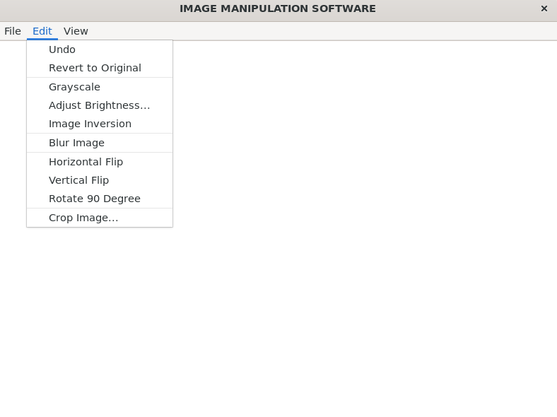
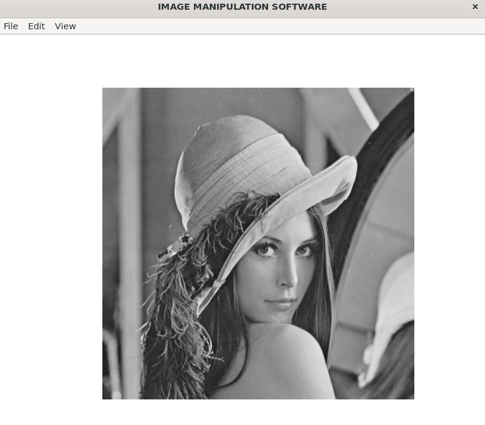
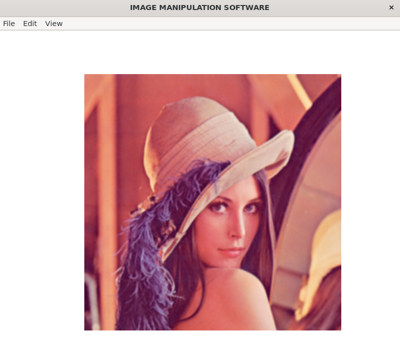
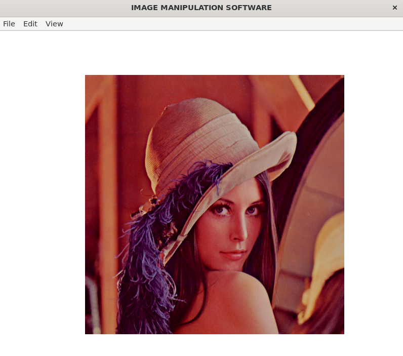

# Image-processing-software

A C-based desktop application for image processing, built using the IUP GUI toolkit. This project allows users to load ` 24 bit uncompressed.bmp` images, apply various transformations and filters, and save the edited results.

## Features

* **File Operations:** Open and Save `.bmp` image files.
* **Basic Editing:** Undo last action, revert to original image.
* **Transformations:** 
  * Rotate 90 degrees clockwise
  * Flip Horizontally & Vertically
  * Crop to specific coordinates
* **Filters & Adjustments:**
  * Apply Grayscale
  * Adjust Brightness (0 to 255)
  * Invert Colors
  * 3x3 Neighborhood Blur (Kernel-less implementation)
 
 ## File Structure
 
  * main.c: Application entry point.
  * gui.c / gui.h: IUP GUI layout, controls, and callback handlers.
  * image.c / image.h: Image memory allocation, pixel structures, and BMP file I/O.
  * process.c / process.h: Core pixel processing algorithms in pure C.
  * iup_gip.gz: Bundled IUP header and library files.
    
## Screenshots
### 1. Main Interface

### 2. Image Loaded

### 3. Applying Grayscale

### 4. Applying blur 

### 5. Adjusting Brightness

## How to Compile and Run

To run this software, you need `gcc` and the IUP library installed on your system. 

Run the following command in your terminal to compile the project:
`gcc main.c gui.c image_manage.c image_process.c -o image_editor -liup`

To launch the application:
`./image_editor`
